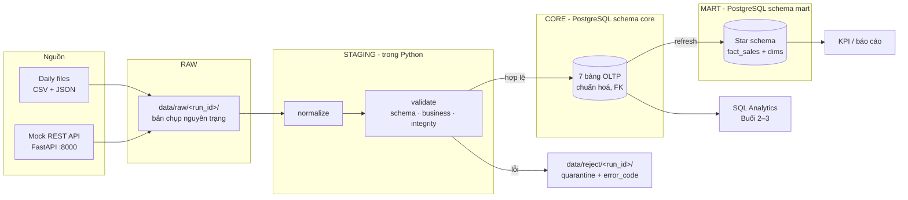

# 2. Kiến trúc hệ thống

← [1. Tổng quan](01_tong_quan.md) · Tiếp: [3. Cấu trúc thư mục](03_cau_truc_thu_muc.md) →

## 2.1 Các tầng dữ liệu

Nền tảng được tổ chức thành 4 tầng, mỗi tầng có một trách nhiệm rõ ràng:



| Tầng | Vị trí | Trách nhiệm |
|---|---|---|
| **RAW** | `data/raw/<run_id>/` | Giữ nguyên dữ liệu nguồn đúng như nhận được. Không bao giờ sửa. |
| **STAGING** | Trong bộ nhớ Python (`transform.py`, `validators/`) | Chuẩn hoá định dạng, kiểm tra chất lượng, tách hợp lệ / lỗi. |
| **CORE** | PostgreSQL, schema `core` | OLTP normalized: 7 bảng, khoá ngoại, CHECK, index. Nguồn sự thật. |
| **MART** | PostgreSQL, schema `mart` | Star schema cho analytics: 1 fact + các dimension. |

Song song, mỗi lần chạy pipeline sinh ra các **runtime artifact**:

| Artifact | Vị trí | Nội dung |
|---|---|---|
| Log | `logs/pipeline.log` | Timestamp, level, message của từng bước |
| DQ report | `reports/data_quality_report.csv` | Input / valid / rejected theo dataset |
| Checkpoint | `metadata/pipeline_state.json` | Watermark `updated_at` của lần chạy thành công gần nhất |
| Reject | `data/reject/<run_id>/` | Bản ghi lỗi kèm `error_code` |

Tất cả thư mục runtime được `.gitignore` bỏ qua (chỉ giữ `.gitkeep`).

## 2.2 Hạ tầng

Hai service chạy bằng Docker Compose ([docker-compose.yml](../docker-compose.yml)):

| Service | Container | Image | Port | Ghi chú |
|---|---|---|---|---|
| `postgres` | `ecommerce-postgres` | `postgres:16` | 5432 | Volume `postgres_data`, có healthcheck `pg_isready` |
| `mock-api` | `ecommerce-mock-api` | build từ `mock_api/` | 8000 | Mount `mock_api/data` read-only, key từ `MOCK_API_KEY` |

Python chạy trên máy host trong `.venv` (Python 3.11) và kết nối tới hai container qua `localhost`.

```
┌──────────────── Máy host ────────────────┐
│  .venv / Python 3.11                      │
│  src/pipeline.py ──┬──► localhost:5432 ───┼──► [ecommerce-postgres]  core / mart
│                    └──► localhost:8000 ───┼──► [ecommerce-mock-api]  /customers, /orders…
│  DBeaver / psql ─────► localhost:5432     │
└───────────────────────────────────────────┘
```

## 2.3 Thư viện Python ([requirements.txt](../requirements.txt))

| Thư viện | Dùng để |
|---|---|
| `pandas` | Đọc CSV/JSON, profiling, transform |
| `requests` | Gọi REST API |
| `SQLAlchemy` + `psycopg` | Kết nối và upsert PostgreSQL |
| `python-dotenv` | Đọc `.env` |
| `pytest` | Chạy test Data Quality |
| `fastapi` + `uvicorn` | Mock API |
| `matplotlib` | Vẽ heatmap cohort |

## 2.4 Luồng pipeline mục tiêu (Buổi 8)

```
Source (file/API) → RAW → normalize → validate → reject | valid → upsert CORE
→ DQ report → checkpoint/watermark → (tuỳ chọn) refresh MART
```

- Thứ tự nạp theo **dependency** (cha trước, con sau): `customers → products → orders → order_items → payments`.
- Checkpoint chỉ được ghi **sau khi run thành công** → nếu lỗi giữa chừng, lần chạy sau vẫn lấy lại đúng khoảng dữ liệu.
- Upsert bằng `INSERT ... ON CONFLICT ... DO UPDATE` → chạy lại không tạo trùng khoá chính.

Chi tiết từng module: [8. Python pipeline](08_python_pipeline.md).
