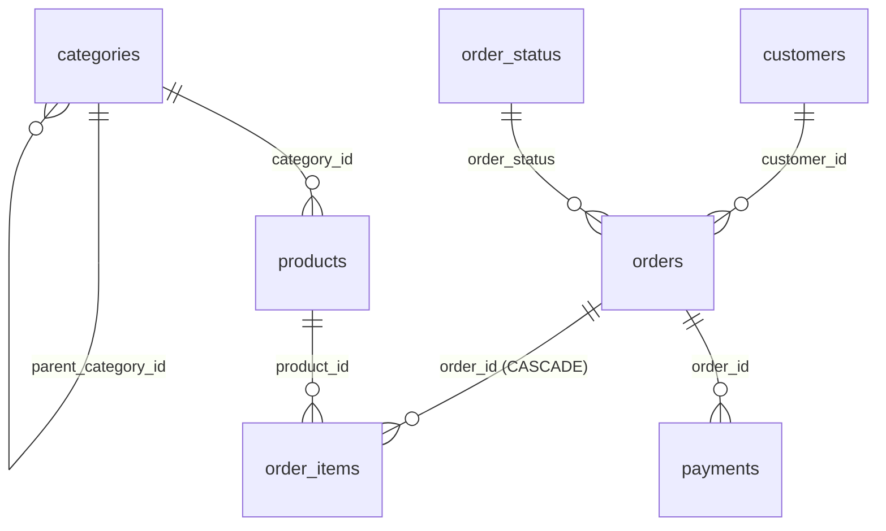

# 5. Database OLTP – schema `core`

← [4. Dữ liệu](04_du_lieu.md) · Tiếp: [6. SQL Analytics](06_sql_analytics.md) →

Nguồn: [sql/student/01_create_oltp.sql](../sql/student/01_create_oltp.sql) · ERD: [database/ecommerce_oltp.dbml](../database/ecommerce_oltp.dbml) · Ảnh ERD: [docs/evidence/01-erd.png](../docs/evidence/01-erd.png)

## 5.1 Sơ đồ quan hệ

- `order_items` là **bảng cầu nối** giải quyết quan hệ n-n giữa `orders` và `products`.
- `order_status` là **bảng lookup** – thay vì CHECK cứng trong `orders`, trạng thái đơn được ràng buộc bằng FK.
- `categories` **tự tham chiếu** để biểu diễn danh mục đa cấp (`parent_category_id = NULL` là danh mục gốc).

**Thứ tự tạo/nạp:** cha trước, con sau – `categories → customers → products → order_status → orders → order_items → payments`. Khi xoá thì ngược lại.

## 5.2 Chi tiết từng bảng

### categories
| Cột | Kiểu | Ràng buộc |
|---|---|---|
| `category_id` | VARCHAR(10) | PK |
| `category_name` | VARCHAR(120) | NOT NULL |
| `parent_category_id` | VARCHAR(10) | FK → categories, nullable |
| `created_at`, `updated_at` | TIMESTAMPTZ | NOT NULL, DEFAULT now() |

### customers
| Cột | Kiểu | Ràng buộc |
|---|---|---|
| `customer_id` | VARCHAR(12) | PK |
| `full_name` | VARCHAR(150) | NOT NULL |
| `email` | VARCHAR(200) | NOT NULL, UNIQUE, CHECK regex email |
| `phone`, `city` | VARCHAR | nullable |
| `customer_segment` | VARCHAR(30) | NOT NULL |
| `status` | VARCHAR(20) | CHECK `active`/`inactive` |
| audit | `source_system` (DEFAULT `'unknown'`), `ingested_at` (DEFAULT now()), `created_at`, `updated_at` | |

### products
| Cột | Kiểu | Ràng buộc |
|---|---|---|
| `product_id` | VARCHAR(12) | PK |
| `category_id` | VARCHAR(10) | NOT NULL, FK → categories |
| `product_name` | VARCHAR(200) | NOT NULL |
| `unit_price`, `cost_price` | NUMERIC(14,2) | ≥ 0; **bonus:** `unit_price ≥ cost_price` |
| `status` | VARCHAR(20) | CHECK `active`/`inactive`/`discontinued` |
| audit | như trên | |

### order_status (lookup)
| Cột | Kiểu | Ràng buộc |
|---|---|---|
| `order_status` | VARCHAR(20) | PK, CHECK 5 giá trị |
| `status_name` | VARCHAR(50) | NOT NULL |
| `status_order` | INTEGER | > 0 (thứ tự trong luồng 1→5) |
| `is_final` | BOOLEAN | DEFAULT false (true cho completed/cancelled) |

### orders
| Cột | Kiểu | Ràng buộc |
|---|---|---|
| `order_id` | VARCHAR(12) | PK |
| `customer_id` | VARCHAR(12) | NOT NULL, FK → customers |
| `order_date` | TIMESTAMPTZ | NOT NULL; **bonus:** ≤ NOW() |
| `order_status` | VARCHAR(20) | NOT NULL, FK → order_status |
| `shipping_city` | VARCHAR(100) | nullable |
| `channel` | VARCHAR(20) | CHECK `web`/`mobile_app`/`social` |
| `order_total` | NUMERIC(14,2) | ≥ 0 – **đã trừ discount** (đối soát khớp 5000/5000 đơn) |
| audit | như trên; **bonus:** `updated_at ≥ created_at` | |

### order_items
| Cột | Kiểu | Ràng buộc |
|---|---|---|
| `order_item_id` | VARCHAR(16) | PK |
| `order_id` | VARCHAR(12) | FK → orders **ON DELETE CASCADE** |
| `product_id` | VARCHAR(12) | FK → products |
| `quantity` | INTEGER | > 0; **bonus:** ≤ 1000 |
| `unit_price` | NUMERIC(14,2) | ≥ 0 – giá **tại thời điểm bán** (khác `products.unit_price` hiện tại) |
| `discount_amount` | NUMERIC(14,2) | ≥ 0, DEFAULT 0, ≤ `unit_price × quantity` |

### payments
| Cột | Kiểu | Ràng buộc |
|---|---|---|
| `payment_id` | VARCHAR(12) | PK |
| `order_id` | VARCHAR(12) | FK → orders (**không** CASCADE) |
| `payment_date` | TIMESTAMPTZ | **bonus:** ≤ NOW() |
| `payment_method` | VARCHAR(30) | CHECK 4 giá trị |
| `payment_status` | VARCHAR(20) | CHECK 4 giá trị |
| `amount` | NUMERIC(14,2) | ≥ 0; **bonus:** > 0 |

## 5.3 Quyết định thiết kế đáng chú ý

| Quyết định | Lý do |
|---|---|
| `order_items → orders` dùng `ON DELETE CASCADE` | Dòng hàng là một phần của đơn; xoá đơn thì xoá luôn dòng hàng. |
| `payments → orders` **không** CASCADE | Bảo vệ dữ liệu tài chính: không xoá được đơn đã có thanh toán. |
| `order_items → products` không CASCADE | Không xoá được sản phẩm đã từng bán → giữ lịch sử bán hàng. |
| Lưu `unit_price` trong `order_items` | Giá bán có thể thay đổi; doanh thu phải tính theo giá lúc bán. |
| Trạng thái đơn là bảng lookup + FK | Thêm/đổi trạng thái không cần ALTER bảng `orders`; có metadata `status_order`, `is_final`. |
| Tiền dùng `NUMERIC(14,2)` | Không sai số làm tròn như FLOAT. |
| Thời gian dùng `TIMESTAMPTZ` | Dữ liệu nguồn có múi giờ `+07:00`; khi nhóm theo tháng dùng `AT TIME ZONE 'Asia/Ho_Chi_Minh'`. |
| Script idempotent | `CREATE ... IF NOT EXISTS`, `DROP CONSTRAINT IF EXISTS` trước `ADD` → chạy lại không lỗi. |

## 5.4 Index

PostgreSQL chỉ tự tạo index cho PK/UNIQUE, **không** tạo cho FK, nên tạo thủ công:

| Index | Bảng(cột) | Mục đích |
|---|---|---|
| `idx_orders_customer` | orders(customer_id) | JOIN customers ↔ orders |
| `idx_orders_date` | orders(order_date) | Lọc theo thời gian |
| `idx_orders_status` | orders(order_status) | Lọc theo trạng thái |
| `idx_order_items_order` | order_items(order_id) | JOIN orders ↔ items |
| `idx_order_items_product` | order_items(product_id) | JOIN products ↔ items |
| `idx_payments_order` | payments(order_id) | JOIN orders ↔ payments |
| `idx_orders_status_date` | orders(order_status, order_date) INCLUDE (order_total) | **Covering index** cho truy vấn doanh thu theo tháng + trạng thái (xem [6.5](06_sql_analytics.md#65-hiệu-năng--index)) |

## 5.5 Kiểm thử ràng buộc (bonus)

[sql/student/tests/01_bonus_constraint_tests.sql](../sql/student/tests/01_bonus_constraint_tests.sql) chạy các `INSERT` cố ý vi phạm trong 1 transaction rồi `ROLLBACK`. Mỗi câu phải báo `violates check constraint ...`. Kết quả: [docs/evidence/01-bonus-constraint-test.png](../docs/evidence/01-bonus-constraint-test.png).

## 5.6 Verify sau khi tạo

Các truy vấn kiểm tra (đủ 7 bảng, 7 FK, index, CHECK) nằm ở [sql/README.md](../sql/README.md#3-verify). Kết quả đã lưu: [docs/evidence/01-verify-db.txt](../docs/evidence/01-verify-db.txt), log DDL: [docs/evidence/01-ddl-log.txt](../docs/evidence/01-ddl-log.txt).
