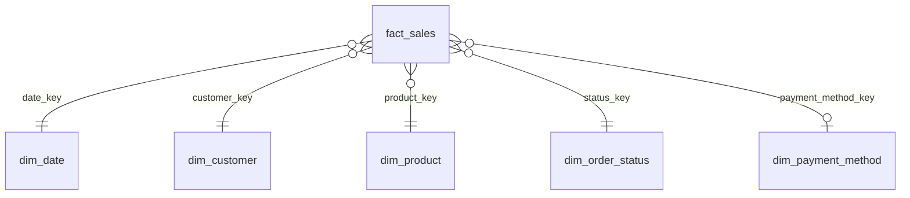

# 7. Sales Data Mart – schema `mart` (Buổi 4)

← [6. SQL Analytics](06_sql_analytics.md) · Tiếp: [8. Python pipeline](08_python_pipeline.md) →

> **Trạng thái:** chưa triển khai. [sql/student/04_data_mart.sql](../sql/student/04_data_mart.sql) hiện chỉ có TODO. Thiết kế Data Mart là sản phẩm học tập của Buổi 4 nên pack không cung cấp đáp án. Phần dưới mô tả **yêu cầu** và hướng tiếp cận.

## 7.1 Vì sao cần Data Mart khi đã có CORE?

| | CORE (OLTP) | MART (OLAP) |
|---|---|---|
| Mục đích | Ghi giao dịch chính xác, toàn vẹn | Đọc nhanh cho báo cáo, KPI |
| Mô hình | Chuẩn hoá (3NF), nhiều bảng nhỏ | Star schema: 1 fact + nhiều dimension |
| Truy vấn KPI | Phải JOIN 4–5 bảng, lọc lại quy ước mỗi lần | JOIN fact với dimension cần thiết, quy ước đã được áp sẵn |

## 7.2 Yêu cầu từ TODO

1. **Xác định grain trước khi viết DDL** – một dòng của fact đại diện cho cái gì (gợi ý tự nhiên: một dòng hàng `order_item`).
2. Tạo các dimension: `dim_date`, `dim_customer`, `dim_product`, `dim_payment_method`, `dim_order_status`.
3. Tạo `fact_sales` và script load từ `core`.
4. Viết **5 query đối soát** OLTP ↔ Data Mart (ví dụ: tổng doanh thu, số đơn, số dòng, doanh thu theo tháng, theo category phải khớp).

## 7.3 Phác thảo star schema (tham khảo, không phải canonical)

| Bảng | Nội dung gợi ý |
|---|---|
| `fact_sales` | order_id, order_item_id, quantity, unit_price, discount_amount, gross_amount, net_amount, channel |
| `dim_date` | date_key, ngày, tháng, quý, năm, thứ trong tuần |
| `dim_customer` | customer_id, city, segment, status |
| `dim_product` | product_id, tên, category, category cha, giá vốn |
| `dim_order_status` | trạng thái, `is_final` |
| `dim_payment_method` | cash / bank_transfer / card / e_wallet |

## 7.4 Liên kết với pipeline

Ở Buổi 8, [starter/src/refresh_mart.py](../starter/src/refresh_mart.py) sẽ chạy lại SQL load của Buổi 4 sau mỗi lần nạp CORE (cờ `--refresh-mart`). Vì vậy script load nên **idempotent** (TRUNCATE + INSERT, hoặc upsert) để refresh nhiều lần không nhân đôi.
