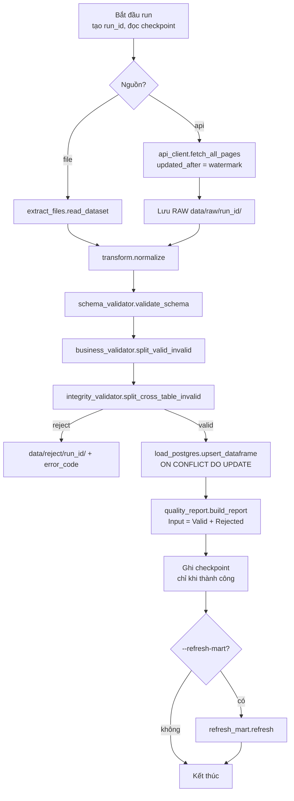

# 8. Python pipeline (Buổi 5–8)

← [7. Data Mart](07_data_mart.md) · Tiếp: [9. Mock API](09_mock_api.md) →

> **Trạng thái:** chỉ có skeleton trong [starter/src/](../starter/src/). Hầu hết hàm đang `raise NotImplementedError`. Đầu Buổi 5 copy sang `src/` (một lần duy nhất) và hoàn thiện ở đó; **không sửa `starter/`**.
>
> ```bash
> [ -d src ] || cp -R starter/src src
> ```

## 8.1 Luồng end-to-end



Các dataset được xử lý **lần lượt theo dependency**: `customers → products → orders → order_items → payments`, để khi kiểm tra integrity của bảng con thì bảng cha đã có trong CORE.

## 8.2 Các module

| Module | Buổi | Hàm | Trạng thái starter | Việc cần làm |
|---|---|---|---|---|
| [config.py](../starter/src/config.py) | 5 | `SETTINGS` | ✅ Có sẵn | Đọc `.env`: `database_url`, `api_url`, `api_key`, đường dẫn `raw/`, `reject/`, `metadata/`, `reports/` |
| [database.py](../starter/src/database.py) | 5 | `engine`, `ping()` | ✅ Có sẵn | SQLAlchemy engine với `pool_pre_ping` |
| [logger.py](../starter/src/logger.py) | 5 | `get_logger()` | ⚠️ Một phần | Thêm file handler (`logs/pipeline.log`) + console handler, format timestamp/level/name/message |
| [extract_files.py](../starter/src/extract_files.py) | 5 | `read_dataset()`, `profile()` | ❌ TODO | Đọc CSV/JSON → DataFrame; profile rows, columns, missing, duplicate |
| [transform.py](../starter/src/transform.py) | 5 | `normalize()` | ❌ TODO | Chuẩn hoá tên cột, trim text, lowercase email/enum, ép kiểu số, parse datetime |
| [api_client.py](../starter/src/api_client.py) | 6 | `fetch_all_pages()` | ❌ TODO | `requests` + header `X-API-Key` + timeout + pagination đến `has_next=false` + retry có giới hạn |
| [load_postgres.py](../starter/src/load_postgres.py) | 6 | `upsert_dataframe()` | ❌ TODO | `INSERT … ON CONFLICT (pk) DO UPDATE`, trả số inserted/updated. Bảng PK đã khai báo sẵn |
| [validators/schema_validator.py](../starter/src/validators/schema_validator.py) | 7 | `validate_schema()` | ❌ TODO | Phát hiện thiếu cột bắt buộc (`REQUIRED` đã có) → `ValueError` nêu rõ dataset/cột |
| [validators/business_validator.py](../starter/src/validators/business_validator.py) | 7 | `split_valid_invalid()` | ❌ TODO | Rule theo dòng → `(valid_df, reject_df có error_code)` |
| [validators/integrity_validator.py](../starter/src/validators/integrity_validator.py) | 7 | `split_cross_table_invalid()` | ❌ TODO | FK giữa các bảng + `payment_date ≥ order_date` |
| [quality_report.py](../starter/src/quality_report.py) | 7 | `build_report()` | ❌ TODO | Ghi CSV report, kiểm tra `Input = Valid + Rejected` |
| [refresh_mart.py](../starter/src/refresh_mart.py) | 8 | `refresh()` | ❌ TODO | Chạy SQL load Data Mart của Buổi 4 |
| [pipeline.py](../starter/src/pipeline.py) | 8 | `run()` | ❌ TODO | Điều phối 7 bước (xem 8.1), CLI `--source`, `--input-dir`, `--refresh-mart` |

## 8.3 Data Quality – ba lớp kiểm tra

| Lớp | Kiểm tra | Ví dụ error_code (theo public tests) |
|---|---|---|
| **Schema** | Đủ cột bắt buộc, đúng kiểu | — (raise `ValueError`) |
| **Business (từng dòng)** | Email hợp lệ; enum status/channel/method; tiền ≥ 0; quantity > 0; discount ≤ gross; ngày bắt buộc parse được | `INVALID_EMAIL`, `NEGATIVE_PRICE`, `INVALID_QUANTITY` |
| **Integrity (liên bảng)** | product→category, order→customer, item→order/product, payment→order, `payment_date ≥ order_date`, duplicate PK | do học viên đặt tên |

Cột bắt buộc theo dataset (`REQUIRED` trong schema_validator):

| Dataset | Cột bắt buộc |
|---|---|
| customers | customer_id, full_name, email, status |
| products | product_id, category_id, product_name, unit_price, status |
| orders | order_id, customer_id, order_date, status, order_total |
| order_items | order_item_id, order_id, product_id, quantity, unit_price, discount_amount |
| payments | payment_id, order_id, payment_date, payment_status, amount |

**Yêu cầu quan trọng:** một dòng bẩn không được làm crash cả batch – nó bị tách sang reject, phần còn lại vẫn được nạp.

## 8.4 Test

[tests/test_validators_public.py](../tests/test_validators_public.py) có 4 test cho `split_valid_invalid`:

| Test | Kỳ vọng |
|---|---|
| `test_bad_email_rejected` | Email `bad` → reject, `INVALID_EMAIL` |
| `test_negative_price_rejected` | `unit_price = -1` → `NEGATIVE_PRICE` |
| `test_quantity_zero_rejected` | `quantity = 0` → `INVALID_QUANTITY` |
| `test_valid_customer_passes` | Khách hợp lệ → 1 valid, 0 reject |

```bash
pytest tests/test_validators_public.py -v
```

Giảng viên có thêm **hidden tests** – pass public tests chưa đảm bảo pass toàn bộ.

## 8.5 Idempotency & checkpoint

- **Upsert theo PK** → chạy lại cùng batch, số dòng CORE không đổi.
- **Watermark** `updated_at` lưu ở `metadata/pipeline_state.json`; lần sau gọi API với `updated_after=<watermark>`.
- Watermark **chỉ ghi khi run thành công** – nếu run lỗi, lần sau lấy lại đúng dữ liệu chưa nạp.
- **RAW trước transform** – nếu logic transform có bug, vẫn có thể replay từ `data/raw/<run_id>/`.

## 8.6 Lệnh chạy mục tiêu

```bash
python -m src.pipeline --source file --input-dir data/incremental/day_2026-07-01
python -m src.pipeline --source both --input-dir data/incremental/day_2026-07-01 --refresh-mart
# chạy lại lần 2 để chứng minh rerun-safe
python -m src.pipeline --source both --input-dir data/incremental/day_2026-07-01 --refresh-mart
```

Gợi ý cho `--source both`: customer/product lấy từ file, transaction (orders, items, payments) lấy từ API.

**Output phải có sau Buổi 8:** `logs/pipeline.log`, `reports/data_quality_report.csv`, `metadata/pipeline_state.json`, `data/raw/<run_id>/`, `data/reject/<run_id>/` (khi chạy dirty batch).
